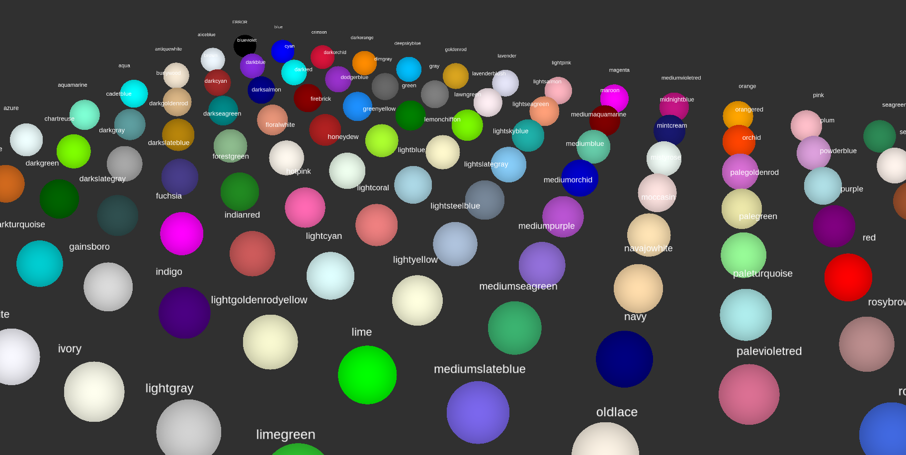

color_names 
====
**ROS package**

Header library to treat preset colors for std_msgs/ColorRGBA.

Color's name is Web Color Name, which is used in color attribute of HTML.

The number of colors is **140**.


## How To Use
```c++
#include "color_names/color_names.h"

std_msgs::ColorRGBA red_color_msg = color_names::makeColorMsg("red");
// Above line is same to below lines
// red_color_msg.r = 1.0;
// red_color_msg.g = 0.0;
// red_color_msg.b = 0.0;
// red_color_msg.a = 1.0;

std_msgs::ColorRGBA skyblue_color_msg = color_names::makeColorMsg("skyblue", 0.5);
// Above line is same to below lines
// skyblue_color_msg.r = 0.529412;
// skyblue_color_msg.g = 0.807843;
// skyblue_color_msg.b = 0.921569;
// skyblue_color_msg.a = 0.5;
```

## Sample

